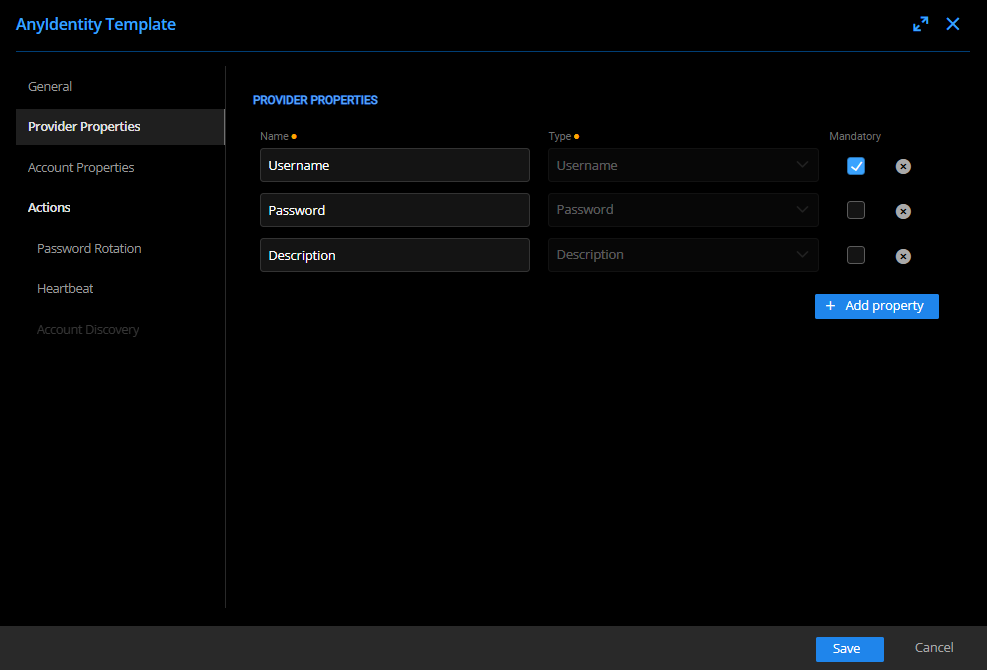
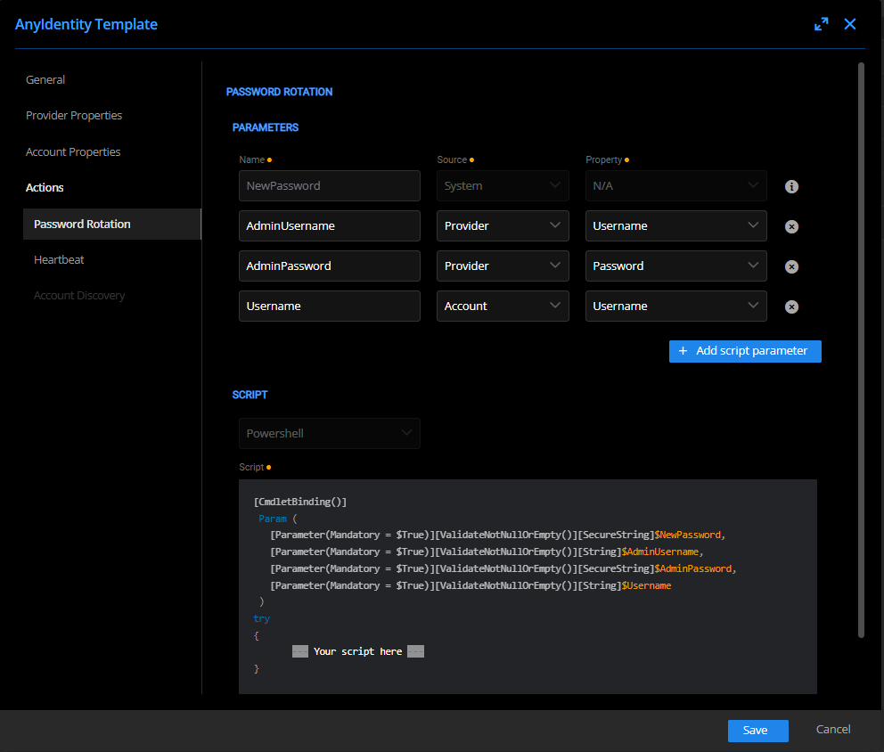

The Template Providers page can be found in the Providers page.
*Administration/PrivilegedAccess/Provider/ProviderTemplate*

Then we create a new template

We only have the choice to implement 3 actions, each of which will have its own script.

-   **Password rotation**, to reset account passwords.
    
-   **Heartbeat**, to synchronize accounts.
    
-   **Account discovery**, for scanning.
    

We then determine the fields that the accounts and providers will implement.

Types are:

-   Username (string)  
-   Password (string)   
-   Description (string)   
-   UniqueIdentifier (string)  
-   String  
-   Int  
-   Bool  
-   Sensitive Data (SecureString)

The **Mandatory** field is used to determine if the fields will be required for creation/edition.

For each action, we insert its script and then we will map the properties of the provider/account that the script needs to work.

**Name**: Name of the variable in the script.

**Source**: If the value is provided by the provider or the account.

**Property**: The source property that will be injected into the script.

We then create a provider with the new type we created and we can now use it.