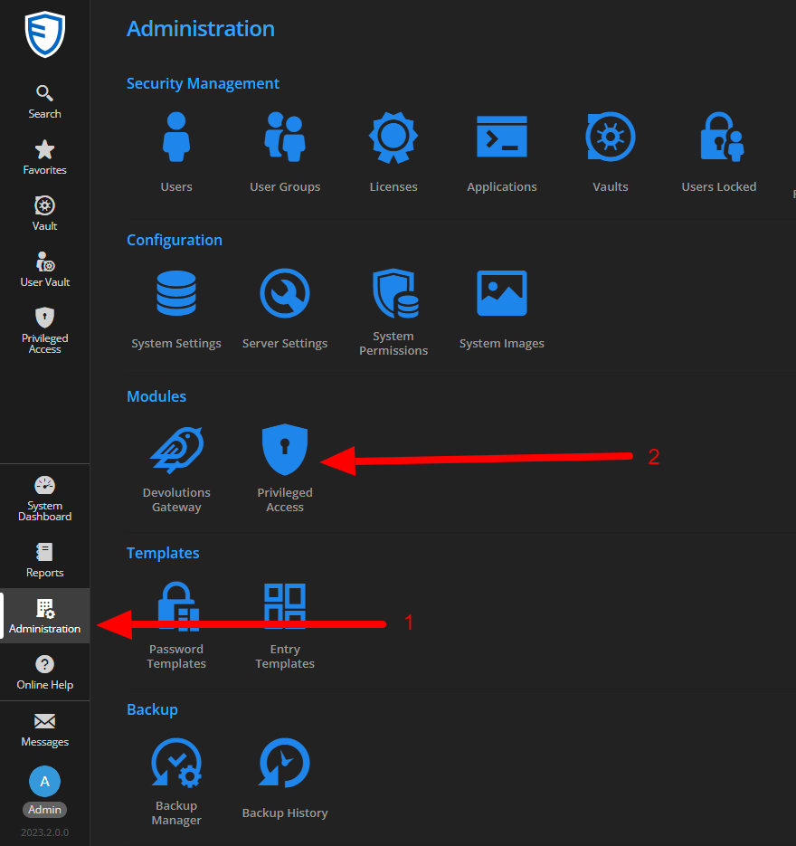
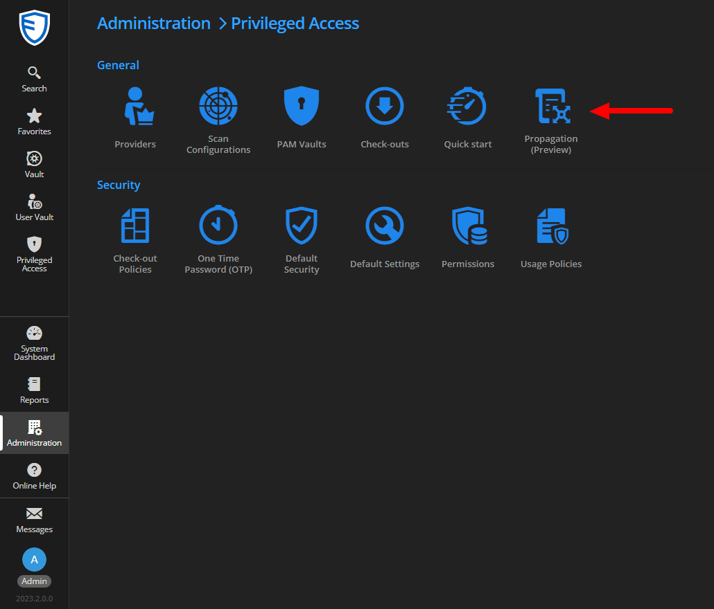
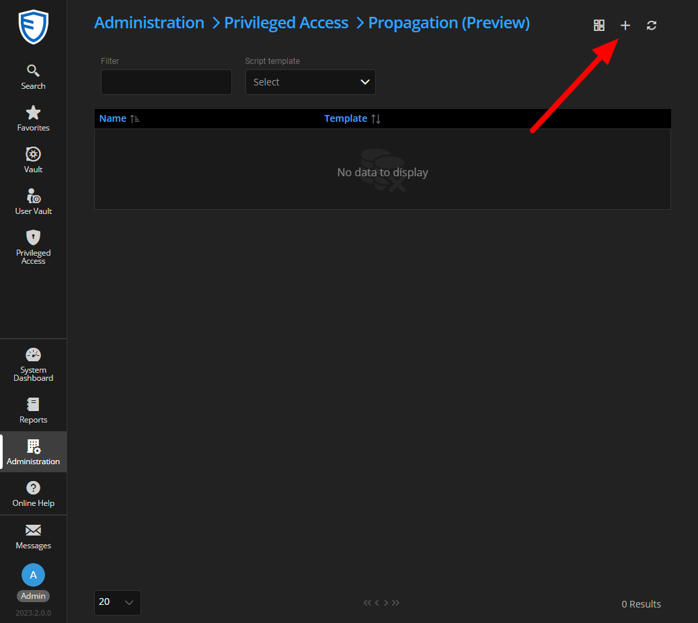
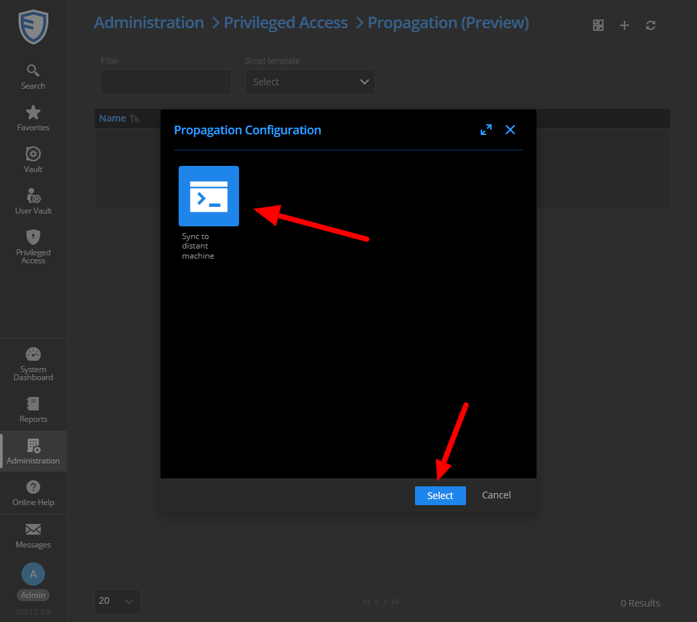
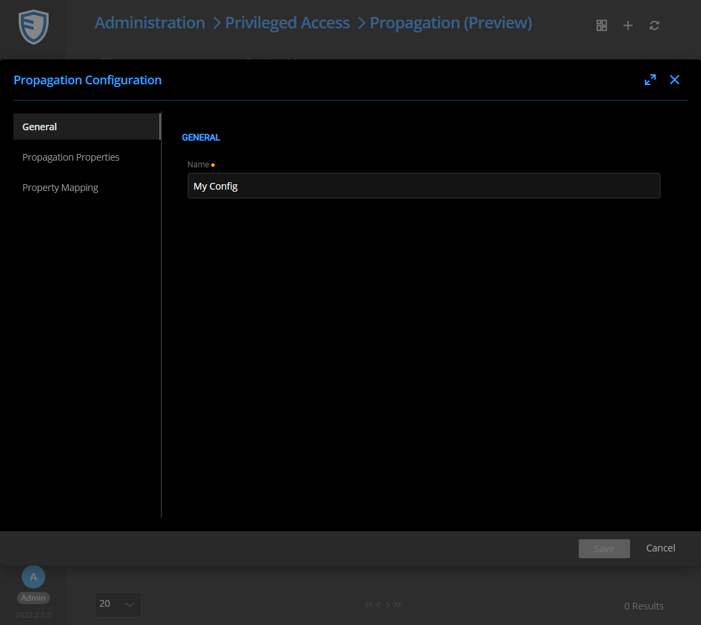
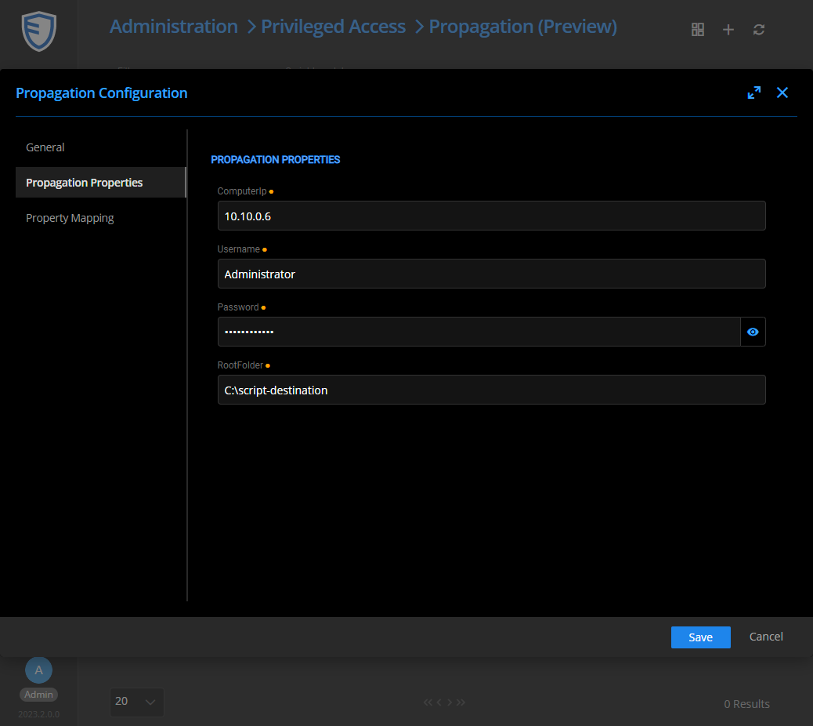
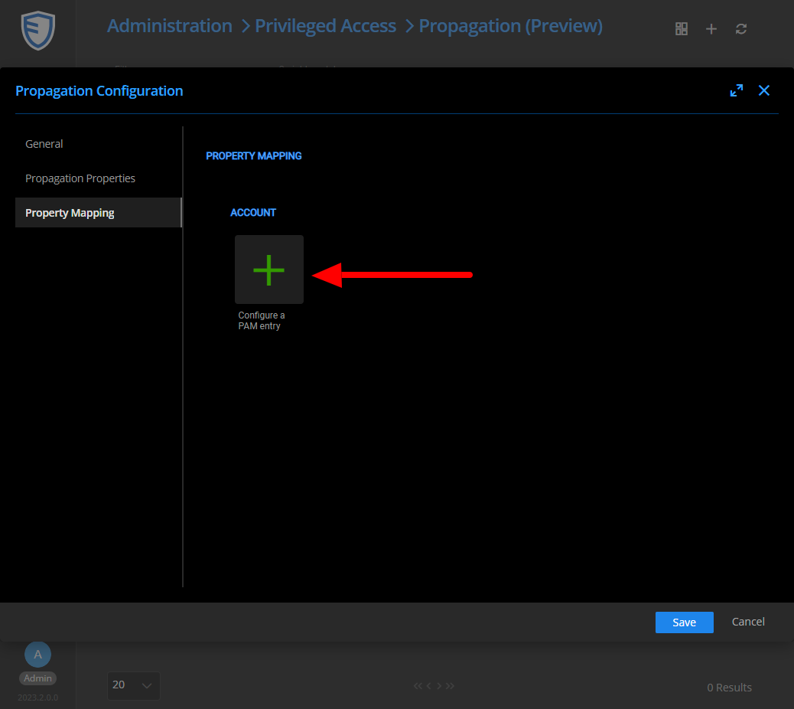
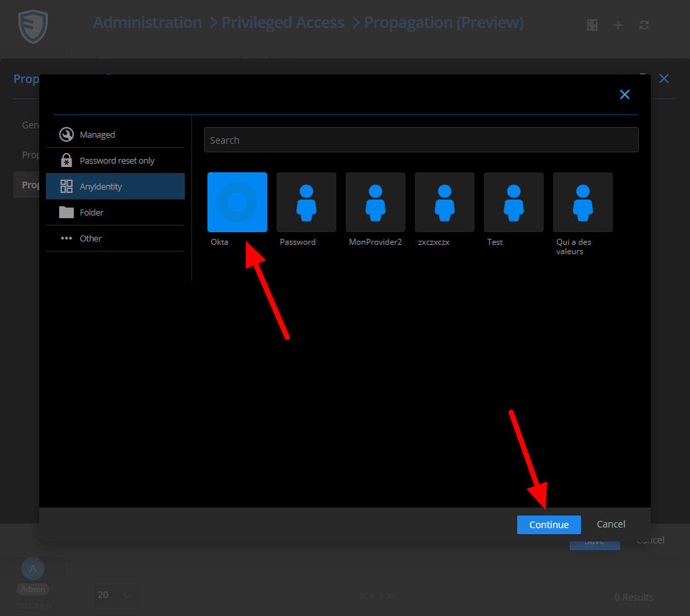
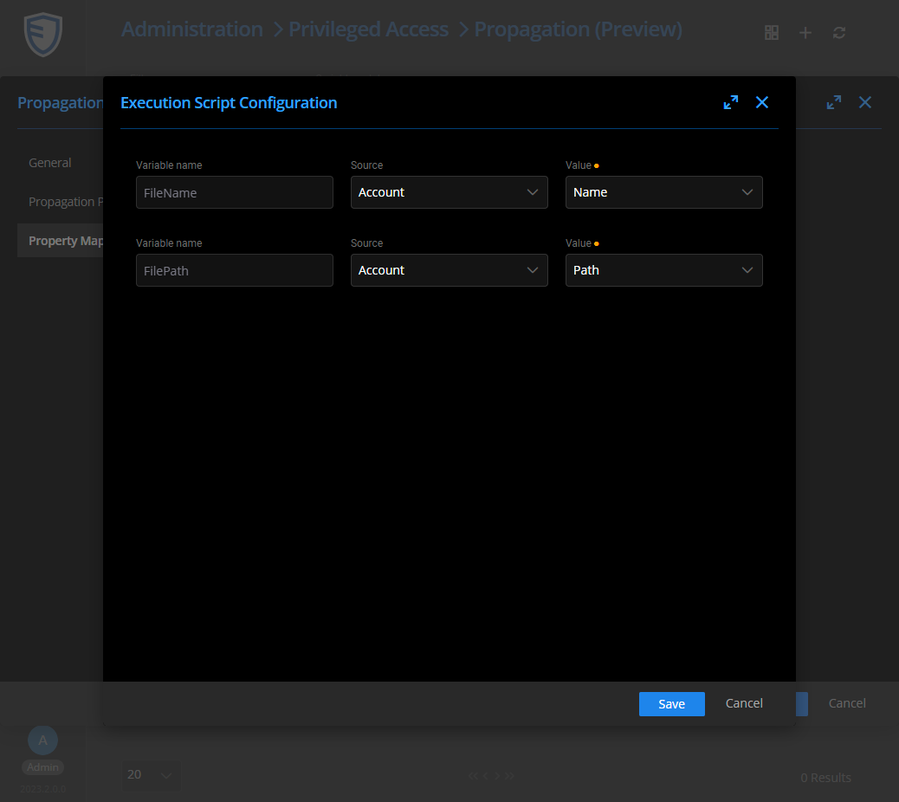
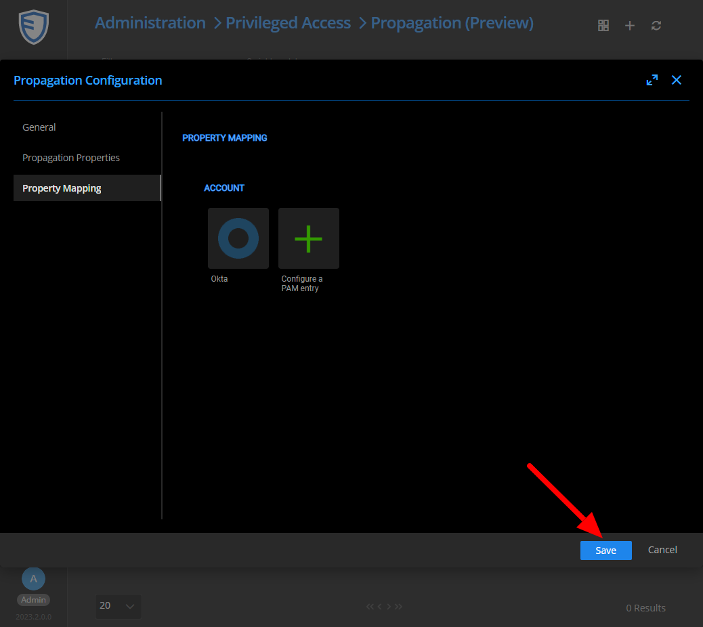

# Configure propagation based on a template

## Context

Whether you have downloaded or created a template manually, you need to configure a propagation afterwards.   
In this document, we are following up on the template created in the [Create a new Template](./Create-A-Template.md) section, but the process is the same if you have downloaded a pre-designed template.

## Configuration

Go to the section **Administration -> Privileged Access -> Propagation**   

Then click on the icon to create a new configuration.   

In the window that appears, select the template from which you want to create the configuration.   

In the General tab, give a name to your configuration.   

In the Propagation Properties tab, fill in the information for the remote machine.   

In the Property Mapping tab, add a configuration for the type of privileged account you want to support.   

In the opened window, select the fields of the account (or its provider) that you want to associate with your variables.   

Finally, save your new configuration.   

You can now move on to the last step, which involves attaching your configuration to a privileged account: [Use a configuration](./Use-A-Configuration.md)