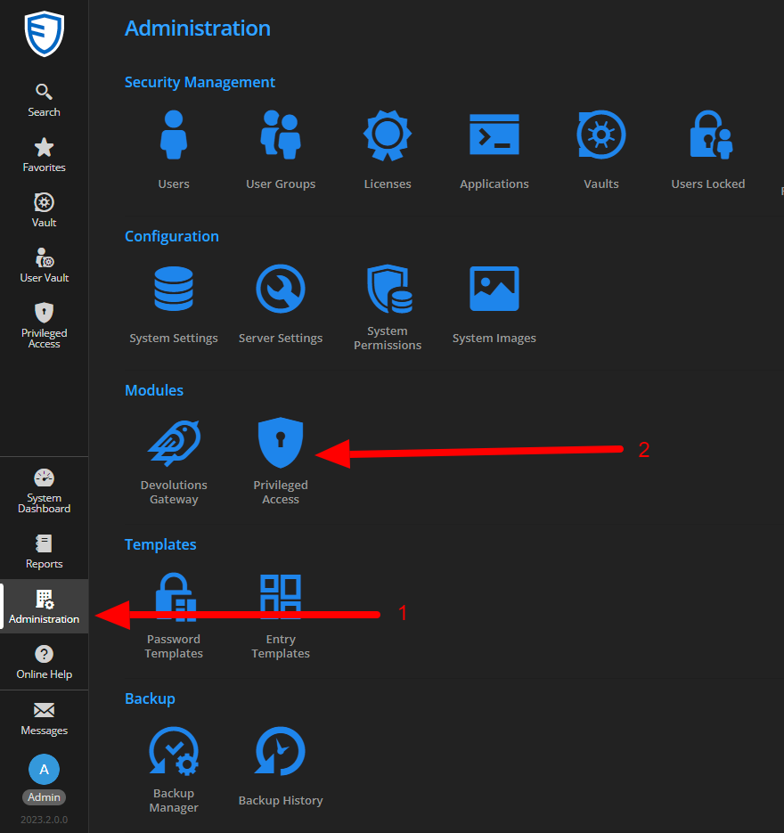
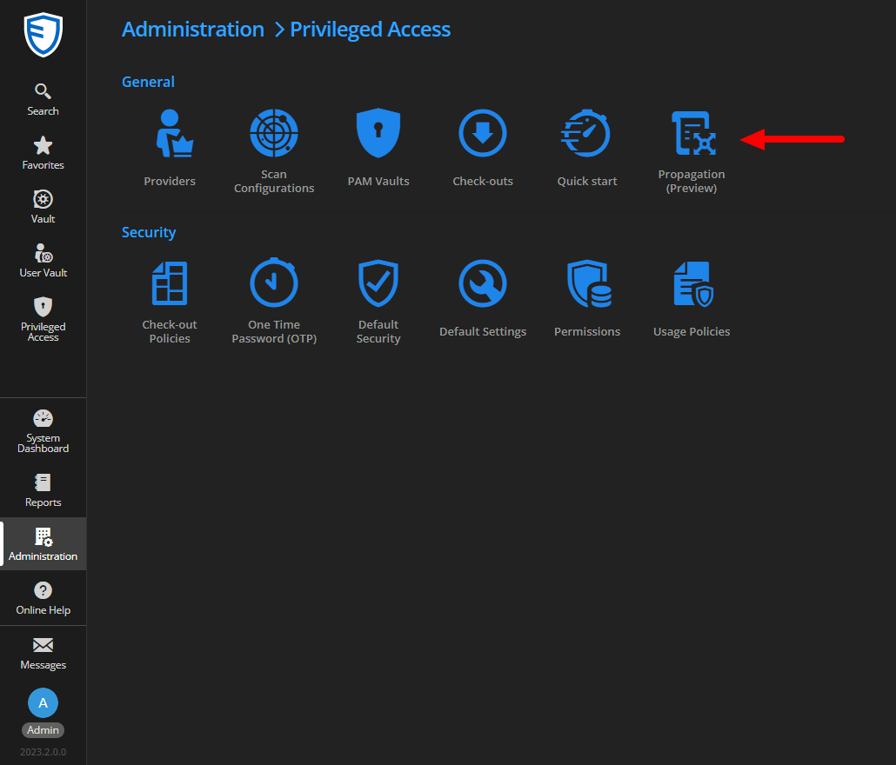

# Create a new Template

## Context
In order to work on something concrete, we will create a simple PowerShell script here that allows us to save password changes to a file on a remote machine.   
This file will be saved under the name of the entry whose password has been changed in a set of folders representing the structure of our vault.

## Creation
First, go to the template listing page.  




Next, click on the button to add a new template.


In the "General" tab, you need to give your template a name and you can change the associated icon and add a description.


In the "Propagation Properties" tab, we will add variables for our script. In our example, there will be 4 variables representing the URL of the remote machine, the username and password for connecting to that remote machine, and finally the destination base folder for the files.


In the "Property Mapping" tab, we will add two variables of type "Field Mapping". The first one will be the file name and the second one will be the full path where the file will be created.


In the last tab "Script", we find all our variables, but also an additional system variable called "NewPassword". It is this variable that, at script execution, will contain the new password for your account.   
To make our lives easier, start by clicking "Generate base script". This will automatically generate the parameters for our script. 


Then click on "edit" and add your script.


Here is the script corresponding to our demo:
```shell
[CmdletBinding()]
       Param (
         [Parameter(Mandatory = $True)][ValidateNotNullOrEmpty()][SecureString]$NewPassword,
         [Parameter(Mandatory = $True)][ValidateNotNullOrEmpty()][String]$ComputerIP,
         [Parameter(Mandatory = $True)][ValidateNotNullOrEmpty()][String]$Username,
         [Parameter(Mandatory = $True)][ValidateNotNullOrEmpty()][SecureString]$Password,
         [Parameter(Mandatory = $True)][ValidateNotNullOrEmpty()][String]$RootFolder,
         [Parameter(Mandatory = $True)][ValidateNotNullOrEmpty()][String]$FileName,
         [Parameter(Mandatory = $True)][ValidateNotNullOrEmpty()][String]$FilePath
       )

# Create a PSCredential for the connection
$credential = New-Object System.Management.Automation.PSCredential($Username, $Password)

# Initialize new session to distant computer
$session = New-PSSession -ComputerName $ComputerIP -Credential $credential

# Convert the secure string to plaintext password
 $plainTextPassword = [Runtime.InteropServices.Marshal]::PtrToStringAuto([Runtime.InteropServices.Marshal]::SecureStringToBSTR($NewPassword))

# Path where to save the file
$completePath = "$RootFolder\$FilePath";

# Command to save the content in a file on the distant computer
Invoke-Command -Session $session -ScriptBlock {
    param($content, $name, $path)
    if (-not (Test-Path $path -PathType Container)) {
        New-Item -Path $path -ItemType Directory | Out-Null
    }
    Set-Content -Path "$path\$name" -Value $content
} -ArgumentList $plainTextPassword , $FileName, $completePath

# Close the session
Remove-PSSession $session

# Return a string to ensure everything was done correctly
return "Script ended successfully"
```

You can now move on to the second part: [Configure propagation based on a template](./Configure-Propagation.md).