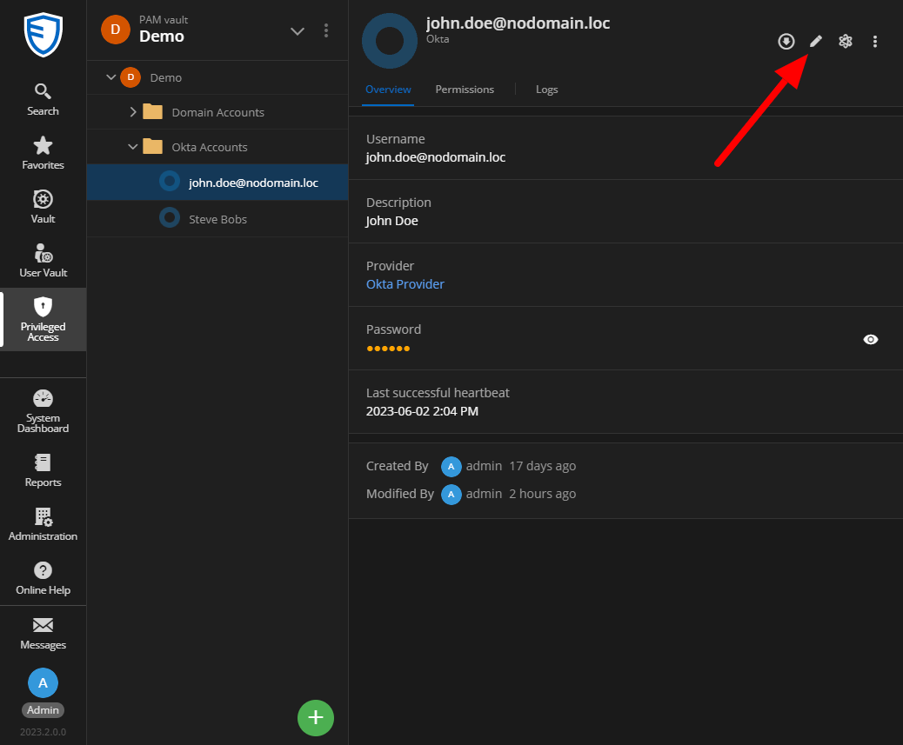
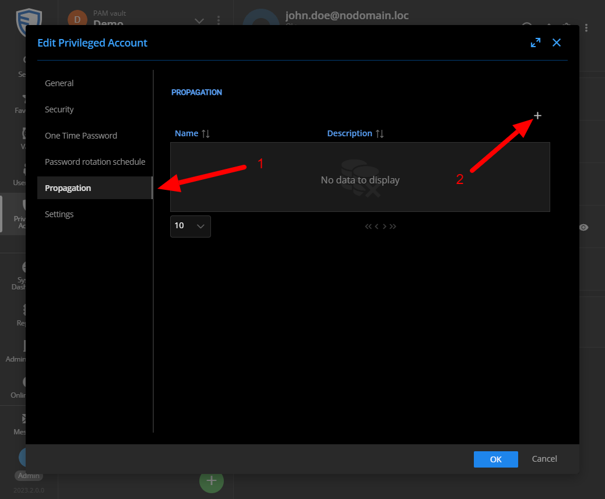
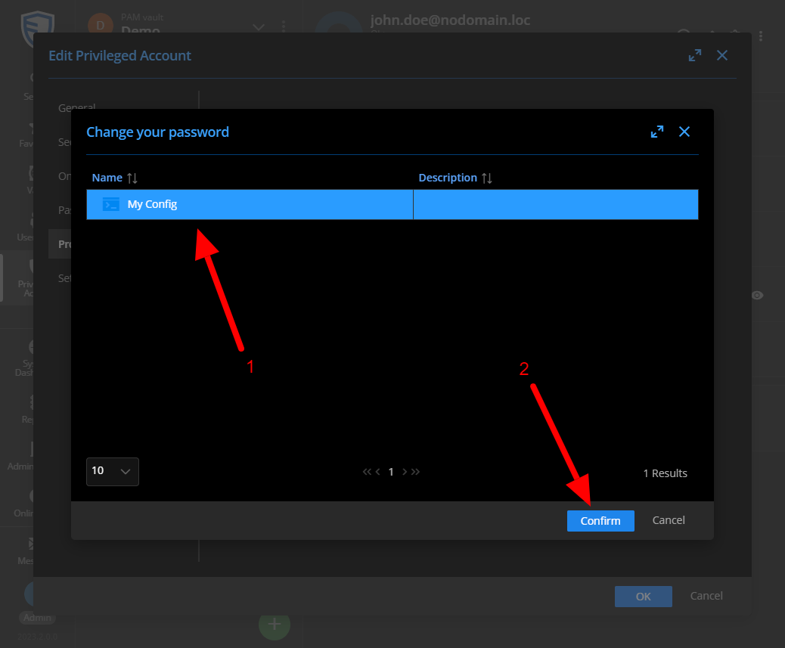
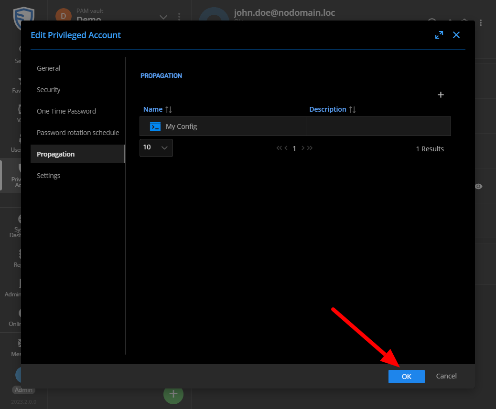
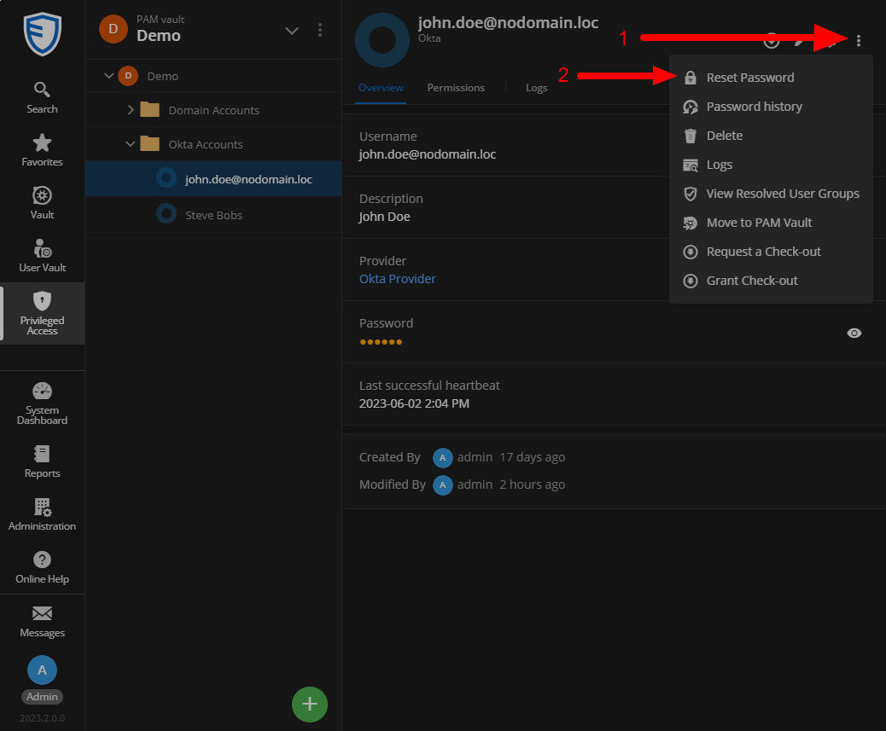

# Use a configuration

## Context

You must have previously created a configuration before following the following instructions.
In this document, we are referring to the configuration created in the previous step [Configure propagation based on a template](./Configure-Propagation.md).

## Use a configuration

Go to your Privileged Access Vaults and select an account of a type that you have configured in your propagation configuration, then edit it.  

In the Propagation tab, click on the icon that allows you to associate a propagation configuration.   

Select the configuration that you want to link to your account (you can select multiple configurations).

Save the changes by clicking on the OK button.

To test that everything is working fine, you can request a password reset for your account.

If everything goes well, you should see the newly created file on your remote machine.

If that is not the case, you can always check the logs of your account where an error should have been recorded.
