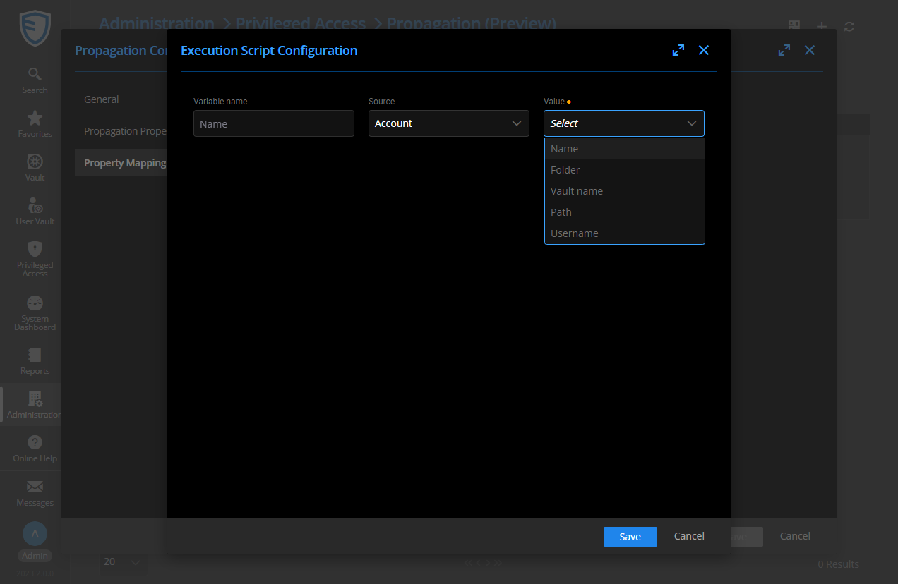

# Azure KeyVault Propagation Template

The provided script allows, following the rotation of a privileged account password, to propagate it to the corresponding secret on your Azure KeyVault.
Once the propagation is performed, the secret's name is used, so the mapping of the field to the Name value must correspond.

Please note that only Azure KeyVault secrets can be updated using this template.

To learn how to configure Azure KeyVault with the template, refer to [this link](../../Providers/Azure%20Key%20Vault/ReadMe.md).
