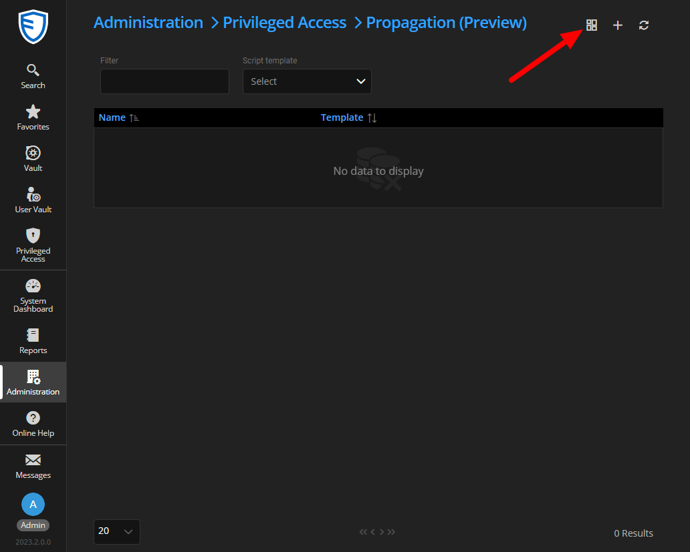

# Download and import Devolutions provided Template

## Download a template file

- Go to the folder [Propagation-Scripts/templates](./templates)
- Get the template corresponding to your needs

As much as possible, you should find specific assistance for each of the available templates referenced on the template help page.

## Importing a template file

Once you have the template in your possession, go to the template propagation page:   

Click on the template import icon:   

Select the previously downloaded template .json file:   

You can review the script if you wish, otherwise just click on "save":   

The new template should now appear.   

You can now proceed to the next step: [Configure propagation based on a template](./Configure-Propagation.md)
