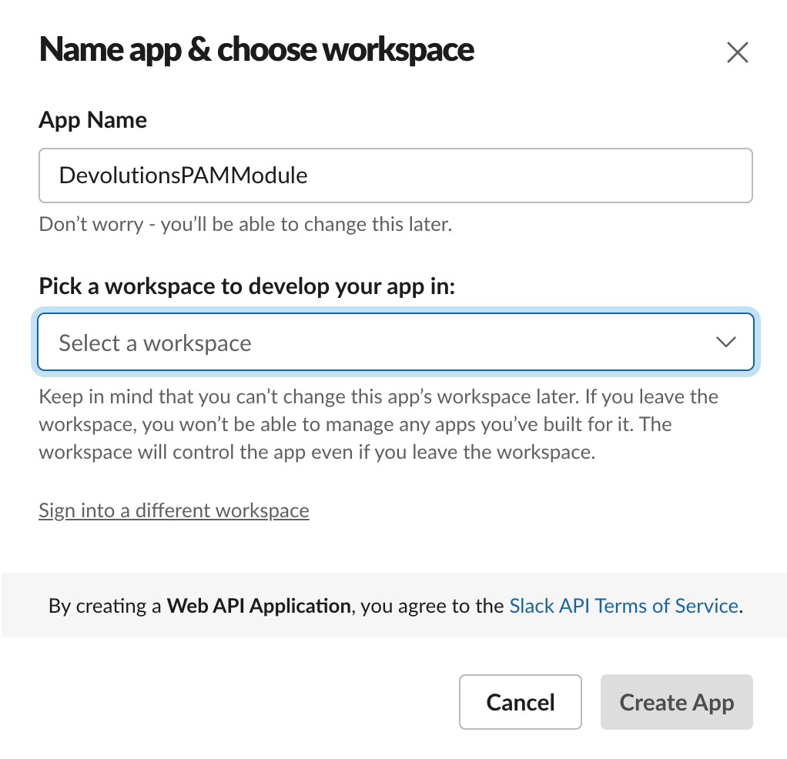
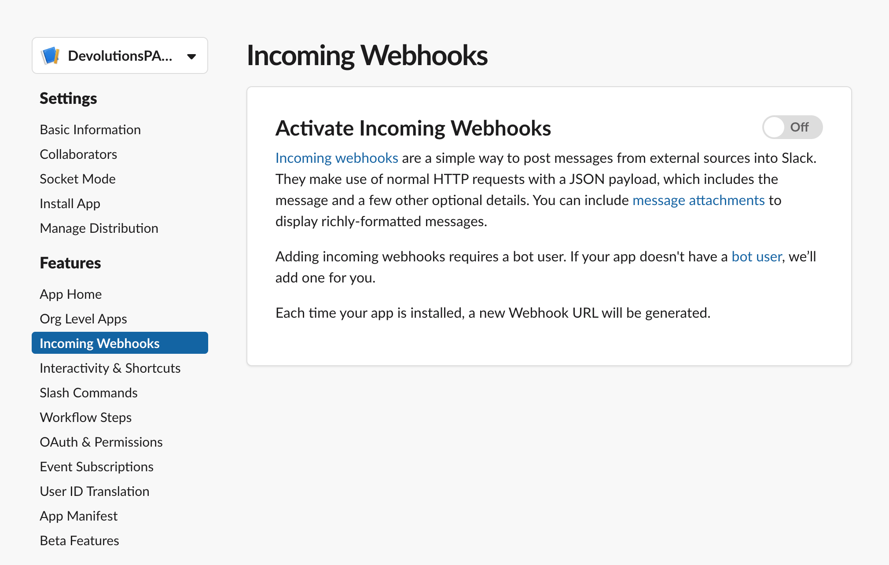
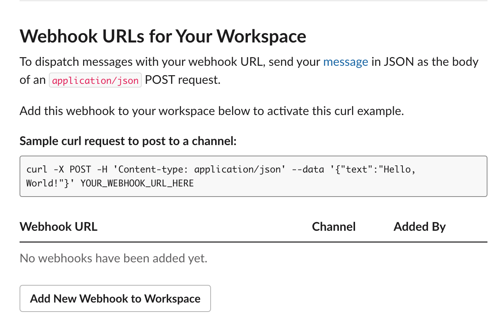
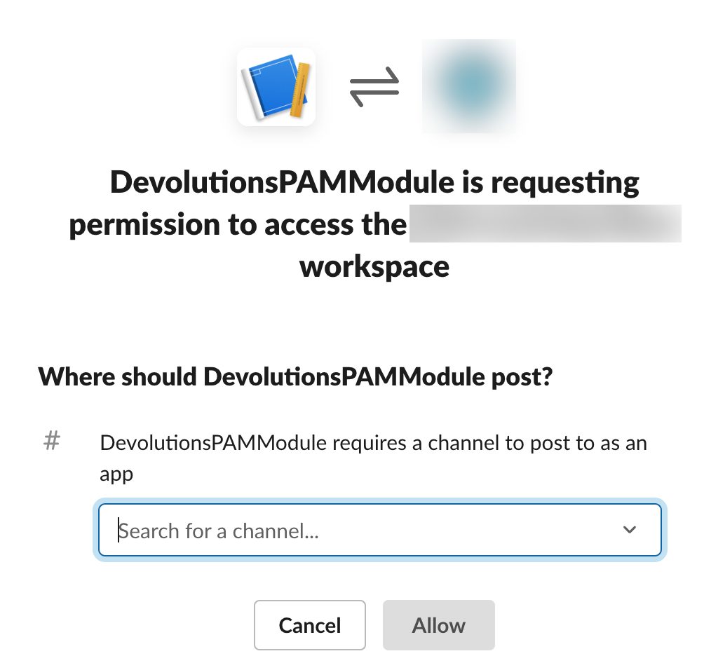
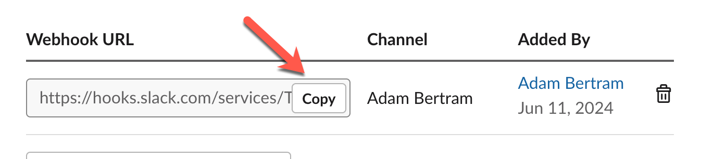
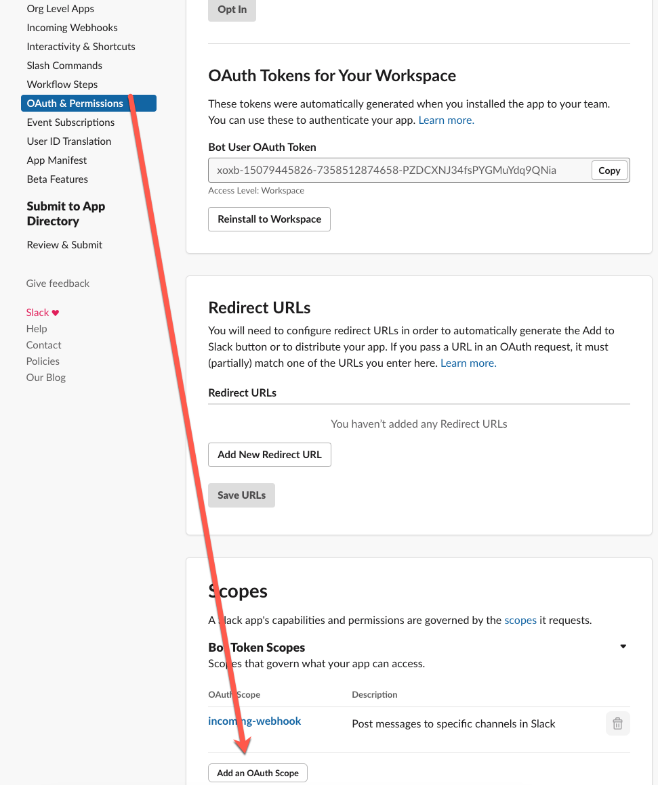
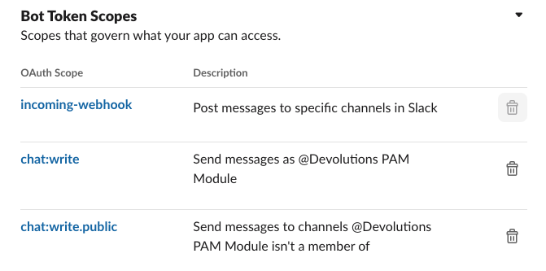

# Slack Notification Secret Propagation

## Overview

This secret propagation script is designed to send notifications to a Slack channel when a password change occurs in the Devolutions Server PAM module. It integrates with Slack's API to post messages, providing real-time updates about password management activities.

## Features

- Sends custom messages to specified Slack channels
- Utilizes Slack's Incoming Webhooks for secure, easy integration
- Supports authentication via OAuth tokens

## Prerequisites

For your AnyIdentity propagation script to communicate with a Slack workspace, you must first create a Slack app. A Slack app is a way that Slack controls authentication and programmatic access to your workspace.

TO create a Slack app, navigate to the [Slack API page](https://api.slack.com/apps?new_app=1) and click "Create an App".

In the "Create an App" page, click on **From scratch**.

Next, pick a descriptive **App Name**, pick the workspace you'd like to receive notifications in and click on **Create App**.

PowerShell needs to communicate with Slack and the way to do with that Slack is via an incoming webhook. Click on the **Incoming Webhooks** section and then toggle on **Activate Incoming Webhooks**.

Next, click on **Add New Webhook to Workspace**.

And select a channel or user to send the AnyIdentity propagation notifications to. This will create the webhook URL.

Click on the **Copy** button to copy the webhook URL to the clipboard. You'll need this in your Slack propagation script.

Next, find **OAuth & Permissions** on the left side of the Slack app page and click on **Add an OAuth Scope**.

Add the **chat:write** and **chat:write.public** scopes to the app. Your **Bot Token Scopes** should now look like below:

Next, click on **reinstall your app** when the notification comes up on the top of the page providing the same information you did when setting up webhooks.

Finally, click on **Copy** to copy the **Bot User OAuth Access Token** to the clipboard. You'll need this in your Slack propagation script.

You're done with the one-time setup! Be sure to have the webhook URL and the bot user OAuth access token handy for your Slack propagation script.

You can run the included `prerequisites.tests.ps1` script against the target server(s) with intended user credentials to ensure all prereqs are met.

## Properties

| Property        | Description                                           | Mandatory | Example                       |
| --------------- | ----------------------------------------------------- | --------- | ----------------------------- |
| `Channel`       | The Slack channel to send the notification to         | Yes       | `"general"`                  |
| `SlackOAuthToken` | The Bot User OAuth Access Token (as a SecureString) | Yes       | `(ConvertTo-SecureString ... )` |
| `WebhookUrl`    | The Incoming Webhook URL for your Slack app           | Yes       | `"https://hooks.slack.com/..."` |
| `Message`       | The message to send to the Slack channel              | Yes       | `"Password changed for user X"` |

## Configuration

1. Ensure you have completed the prerequisites and have your Webhook URL and Bot User OAuth Access Token ready.

2. When setting up the propagation script in the Devolutions Server PAM module, provide the following:
   - The Slack channel name where notifications should be sent.
   - The Bot User OAuth Access Token (ensure it's stored securely).
   - The Webhook URL obtained from your Slack app settings.
   - A template for the notification message, which can include placeholders for dynamic content.

3. Test the configuration by running a manual password change or using the PAM module's test functionality to ensure notifications are sent correctly.

For additional assistance or troubleshooting, refer to the [Devolutions Server documentation](https://docs.devolutions.net/server/) or contact Devolutions support.