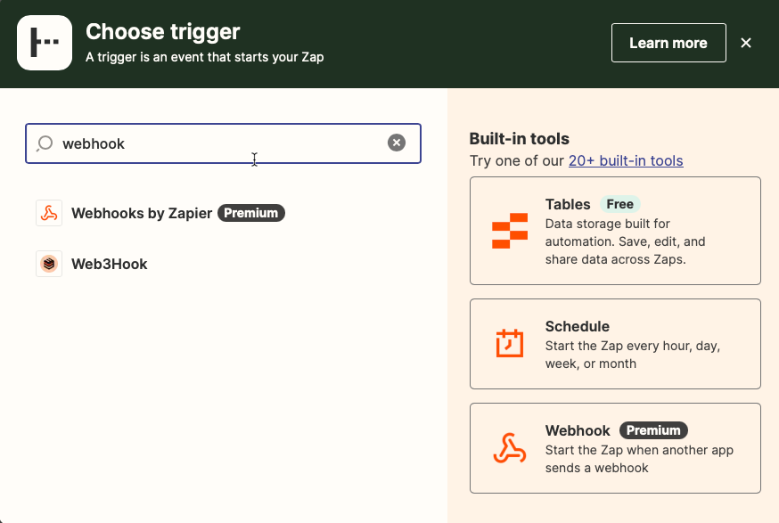
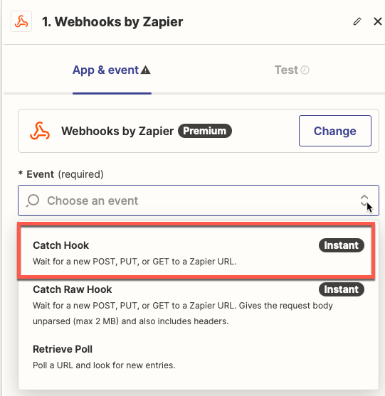
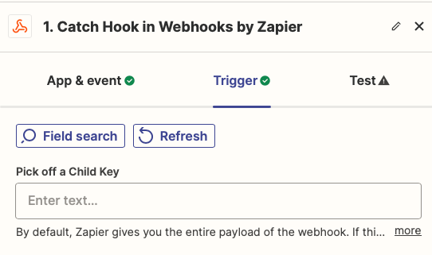
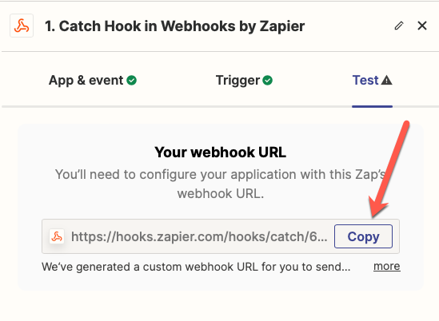
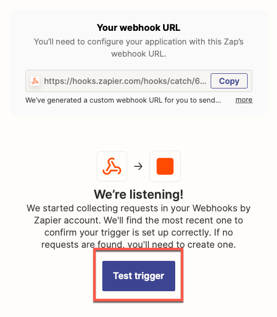
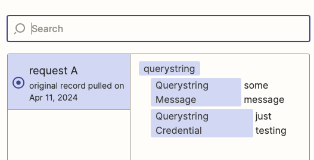

# Zapier Webhook Password Propagation

## Overview

This PowerShell script is designed to propagate password changes or send notifications via a Zapier webhook. It facilitates automated workflows by allowing users to configure a Zapier webhook to handle password updates or messages in real-time.

## Features

- **Webhook Integration**: Integrates directly with Zapier webhooks to enable real-time data transmission.
- **Customizable Payloads**: Allows for the inclusion of custom messages and credential details in the webhook payload.

## Prerequisites

Before using this script, ensure you meet the following prerequisites:

- A premium Zapier account with an active webhook setup.

You can run the included `prerequisites.tests.ps1` script against your local environment to ensure all prerequisites are met.

## Properties

| Property           | Description                                        | Mandatory | Example                                          |
|--------------------|----------------------------------------------------|-----------|--------------------------------------------------|
| `ZapierWebhookUrl` | The URL of the Zapier webhook where the POST request will be sent. | Yes       | `"https://hooks.zapier.com/hooks/catch/123456/abcde"` |
| `Credential`       | The identifier for the credential subject to the propagation or notification. | Yes       | `"User123"`                                      |
| `NewPassword`      | A placeholder parameter to accommodate DVLS. This parameter is mandatory but not sent to Zapier. | Yes       | *SecureString*                                   |
| `Message`          | Optional parameter to include a message in the payload sent to the Zapier webhook. | No        | `"Password updated successfully"`                 |

## Zapier Set Up

Before this propagation script will work, it must have a Zapier webhook URL to send a payload to. Follow the instructions below to walk through Zapier to configure the webhook.

1. Search for the *webhook* trigger and click on it when setting up a new Zap.



2. Set up the trigger with the Event *Catch Hook* and click *Continue*.



3. Click *Continue* to skip the *Pick off a Child Key* option.



4. Click on *Copy* to copy the webhook URL to your clipboard.



5. Run the provided `prerequisites.tests.ps1` script to perform a simple HTTP query to the webhook URL. The test should pass.

```
./prerequisites.tests.ps1 -ZapierWebhookUrl '<webhook url here>'
```

6. Click on *Test trigger*.



You should see the *queryString* that the test script sent with both the *Credential* and *Message* keys.



7. Create your first app passing in the value(s) DVLS sent to the webhook.

> **Note:** The tutorial will send a Slack notification to a channel but, at this point, you're free to connect any integrated app you wish.


8. Fill in the placeholders where you'd like the credential and/or the message passed to the action.


9. Continue building the app as you wish.

10. Save and publish the zap. The Devolutions Server proppagation script now has a place to send notifications when your privileged credentials are changed.