## Prerequisites

The following PowerShell Modules are required. These modules must be installed and accessible to the PowerShell installation on the system hosting the Devolutions Server (DVLS) installation. There is a 5.x version of PowerShell embedded within DVLS that must have access to the PowerShell modules, hence the need to install the modules for the entire system.

- **Az.Accounts** 2.10.3 or higher - `Install-Module -Name Az.Accounts -Scope AllUsers`
- **Az.KeyVault** 4.9.0 or higher - `Install-Module -Name Az.KeyVault -Scope AllUsers`
- **Az.Resources** 6.5.1 or higher (Optional for setup script) - `Install-Module -Name Az.Resources -Scope AllUsers`

## Registering an Azure Active Directory Application for Service Principal Access

1. Navigate to **Azure Active Directory → App registrations** in the Azure Portal. Once there, click the **New registration** button.

    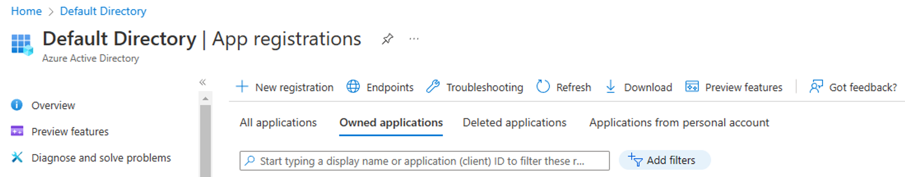

2. Enter a name for the application. In this example, the application is named *AppAzureKeyVaultImageServicePrincipal*. All other values are left as their defaults.

    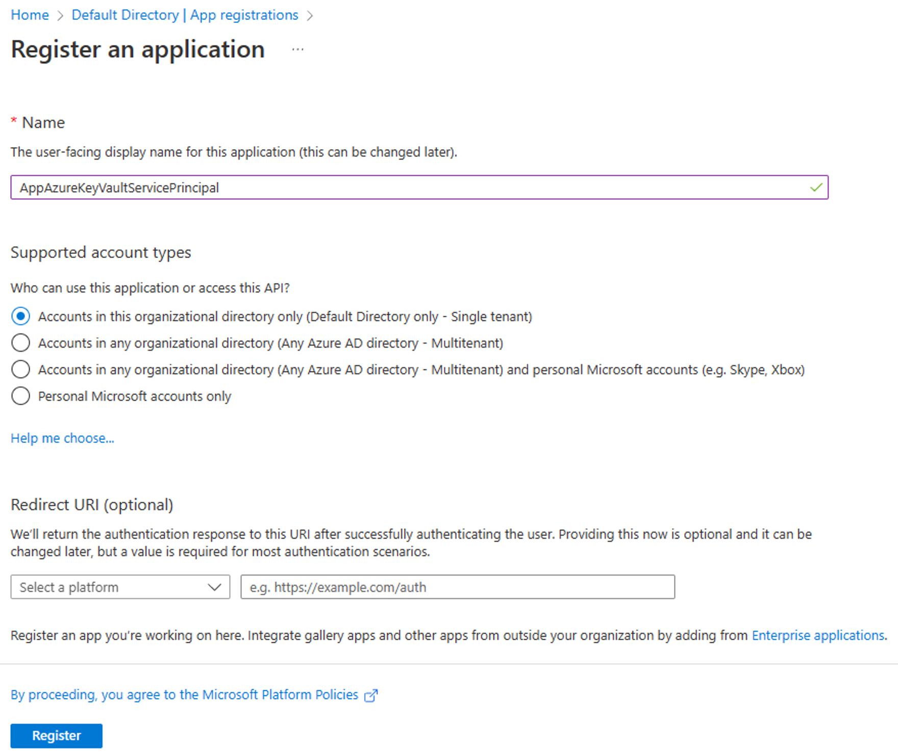

3. Once created, click on the newly created application.

    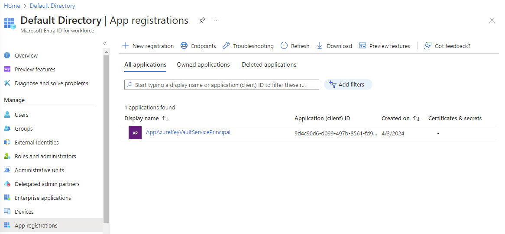

4. Navigate to the **Certificates & secrets** section, click the **Client secrets** tab, and click the **New client secret** button.

    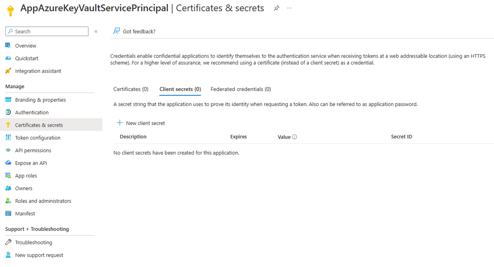

5. Here the defaults of 180 days are used and, in this example a description of **PasswordAccessKeyVault**.

    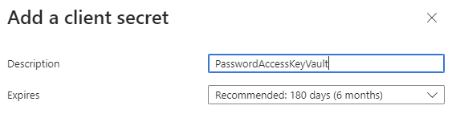

    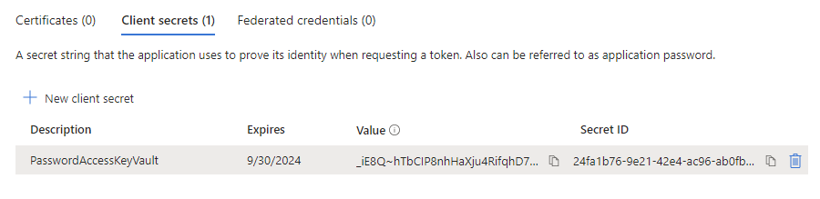

6. Navigate to **Azure Portal → Key Vaults → "Vault Name (Devolutions)" → Access configuration**. Ensure that the option for **Vault access policy** is selected.

    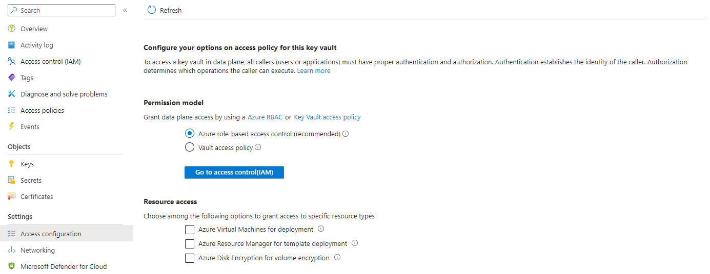

7. Next, click on **Access policies** and the **Create** button.

    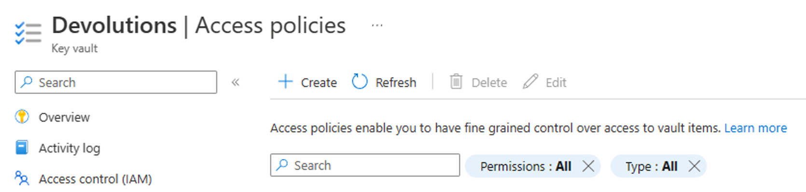

8. Add only the necessary permissions, which are Get and List for Key permissions, and Get, List, and Set for Secret permissions. Click the **Next** button.

    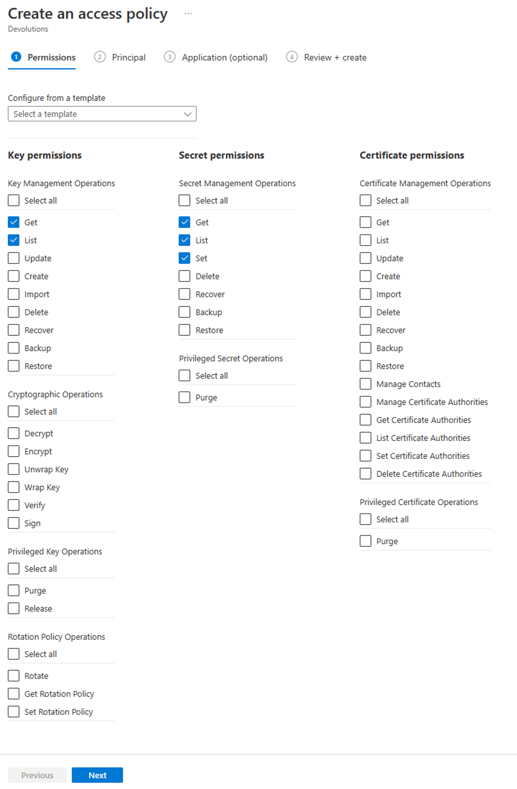

9. Locate the previously created application in Azure Active Directory and select the application.

    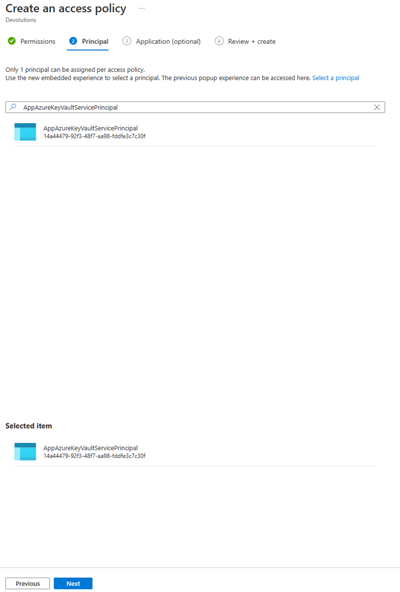

10. Leave all defaults for the **Application** section and click the **Next** button.

    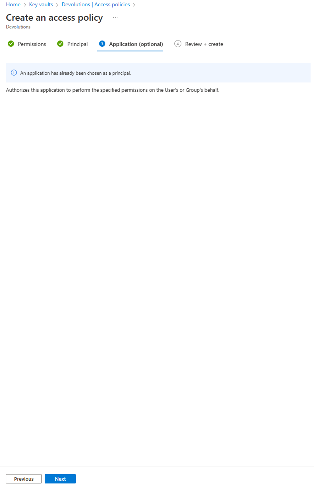

11. Finally, click the **Create** button on the **Review + create** section to finalize the Access Policy creation.

    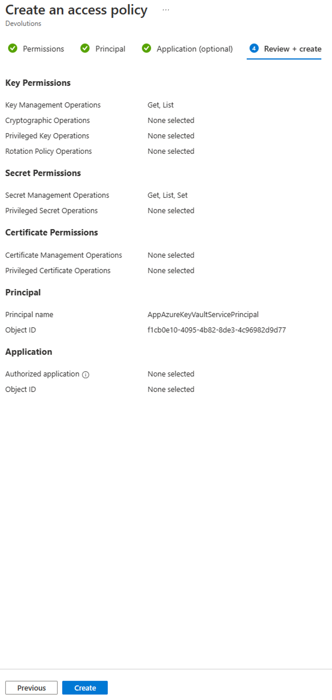

## Creating an Azure Active Directory Application, Service Principal, and Access Policy via the PowerShell Az Module

An alternative method of creating the relevant pieces for the Devolutions Server PAM module to connect to Azure Key Vault is through the Az PowerShell module. An example script is shared below. Modify the initial variables to account for your environment.

```powershell
# Ensure that Tls12 is used to connect for all API functions.
[Net.ServicePointManager]::SecurityProtocol = [Net.SecurityProtocolType]::Tls12

# Modify these variables to reflect your operational needs.
$ApplicationName = 'AppForServicePrincipalKeyVault'
$KeyVault        = 'Devolutions'
$ResourceGroup   = 'Devolutions'
$TenantId        = 'MyTenantID'

# These are the minimum necessary versions, as tested with this code.
$ModulesToImport = @{
  'Az.Accounts'  = '2.10.3'
  'Az.KeyVault'  = '4.9.0'
  'Az.Resources' = '6.5.1'
}

# If your minimum version is older, run Update-Module -Name 'Az'
$ModulesToImport.GetEnumerator() | ForEach-Object {
  Try {
    Import-Module -Name $PSItem.Key -MinimumVersion $PSItem.Value -ErrorAction 'Stop'
  } Catch {
    Write-Error ("Failed to Import Module: {0}" -F $Error[0].Exception.ToString())
    Exit
  }
}

Try {
  $Account = Connect-AzAccount -TenantId $TenantId -ErrorAction 'Stop'
} Catch {
  Write-Error ("Failed to Connect to Azure: {0}" -F $Error[0].Exception.ToString())
  Exit
}

Try {
  $Application = New-AzADApplication -DisplayName $ApplicationName -ErrorAction 'Stop'
} Catch {
  Write-Error ("Failed to Create AD Application: {0}" -F $Error[0].Exception.ToString())
  Exit
}

# Each Azure Application Credential is time-limited.
# The default Start Date is Today, and the default End Date is 1 Year from the time of creation.
# Modify these values with the -StartDate and -EndDate parameters.
Try {
  $ApplicationSecret = $Application | New-AzADAppCredential -ErrorAction 'Stop'
} Catch {
  Write-Error ("Failed to Create AD Application: {0}" -F $Error[0].Exception.ToString())
  Exit
}

# Modify Key Vault Access Configuration for Vault Access Policy, and not RBAC.
Try {
  Get-AzKeyVault -VaultName $KeyVault -ResourceGroupName $ResourceGroup -ErrorAction 'Stop' | Update-AzKeyVault -EnableRbacAuthorization $False -ErrorAction 'Stop'
} Catch {
  Write-Error ("Failed to Update Azure Key Vault Access Configuration: {0}" -F $Error[0].Exception.ToString())
  Exit
}

$Params = @{
  'VaultName'            = $KeyVault
  'ObjectId'             = $Application.Id
  'PermissionsToKeys'    = @('get','list')
  'PermissionsToSecrets' = @('get','list','set')
}

Try {
  $AccessPolicy = Set-AzKeyVaultAccessPolicy @Params -ErrorAction 'Stop'
} Catch {
  Write-Error ("Failed to Add Access Policy: {0}" -F $Error[0].Exception.ToString())
}
```

## Importing the Azure Key Vault PAM Provider JSON

> Functionality to import a PAM Provider via a JSON template is not yet released, as of version **2022.3.13.0**.

Instead of manually creating the PAM Provider, an included `Azure Key Vault.json` file is located in the repository that creates the PAM Provider for you.

## Manually Setting Up the Azure Key Vault PAM Provider

Now that the Azure Key Vault is setup for use with the Devolutions Server PAM module, read on to configure PAM itself for use with the module.

1. Launch the Devolutions Server web portal, and navigate to **Administration → Privileged Access**.

    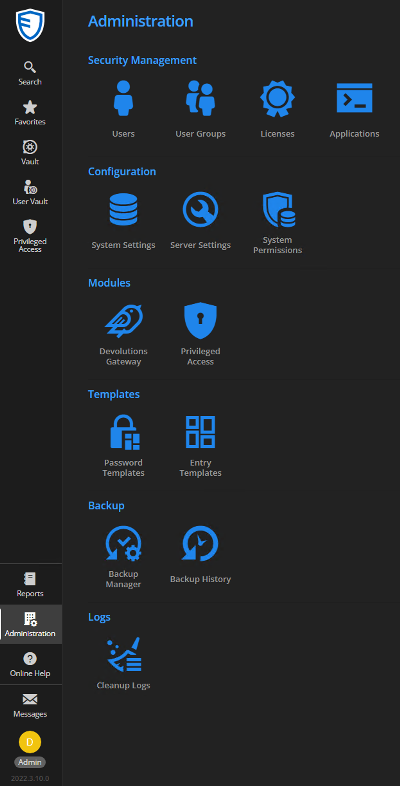

2. Click the **Providers** button.

    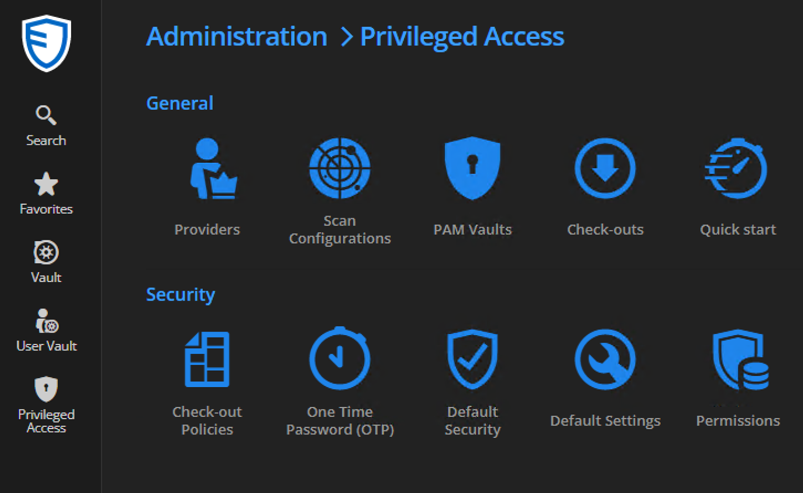

3. Click the **Template** button.

    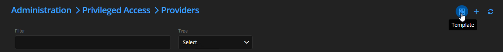

4. Click the **Add** button.

    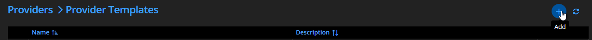

5. On the General tab, enter a name and check the Password rotation, Heartbeat, and Account discovery checkboxes.

    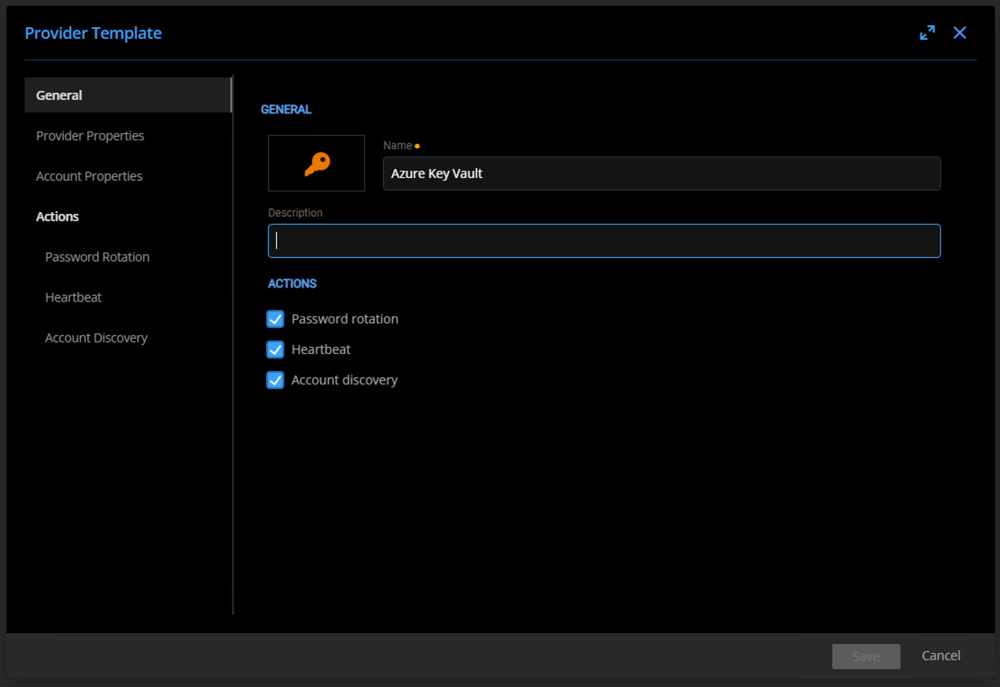

6. On the Provider Properties section, add the following (spelling and spacing matters):

   1. `TenantID` as a **Mandatory** String property.

   2. `ApplicationID` as a **Mandatory** String property.

   3. `Password` as a **Mandatory** Sensitive Data property.

   4. `KeyVaultName` as a **Mandatory** String property.

      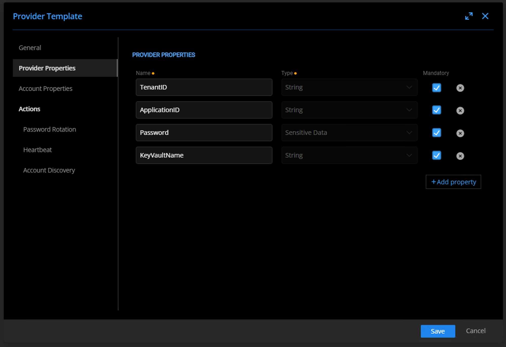

7. On the Account Properties section, add the following (spelling and spacing matters):

   1. `Name` as a **Mandatory** Username property.

   2. `Secret` as a **Mandatory** Password property.

   3. `ID` as a **Mandatory** Unique Identifier property (this may be simply renaming the existing property).

      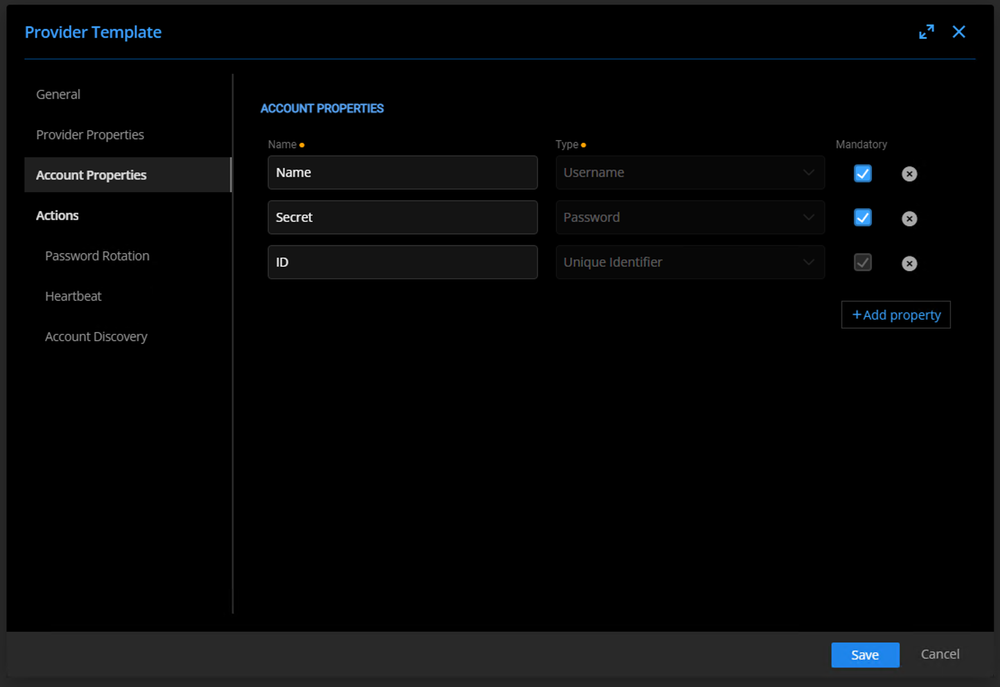

8. On the Password Rotation section, add the following (spelling, spacing, and mapping matters):

   1. `TenantID` from **Provider** and mapped to `TenantID`.

   2. `ApplicationID` from **Provider** and mapped to `ApplicationID`.

   3. `Password` from **Provider** and mapped to `Password`.

   4. `KeyVaultName` from **Provider** and mapped to `KeyVaultName`.

   5. `Name` from **Account** and mapped to `Name`.

   6. `ID` from **Account** and mapped to `ID`.

      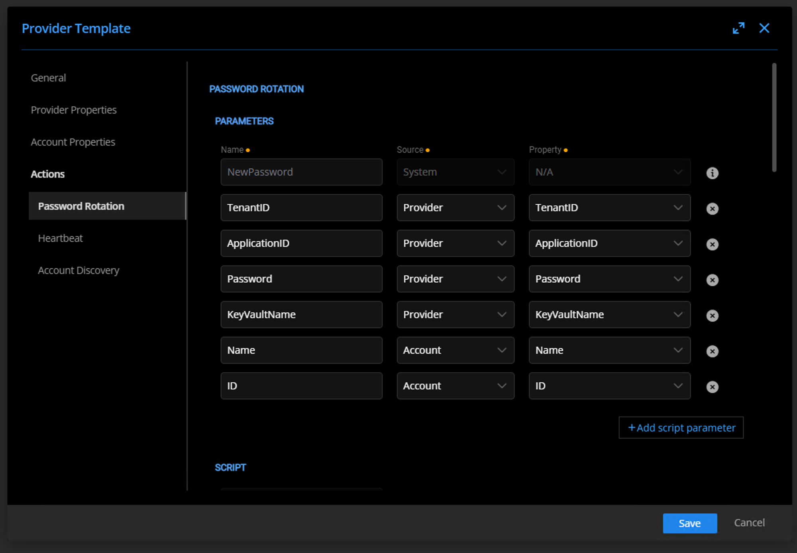

9. Scroll down to the bottom of the Password Rotation section and click on the Edit button to paste in the script located here in the repository: *PAM-Providers/Providers/Azure Key Vault/Script/AzureKeyVaultImageResetPassword.ps1*

    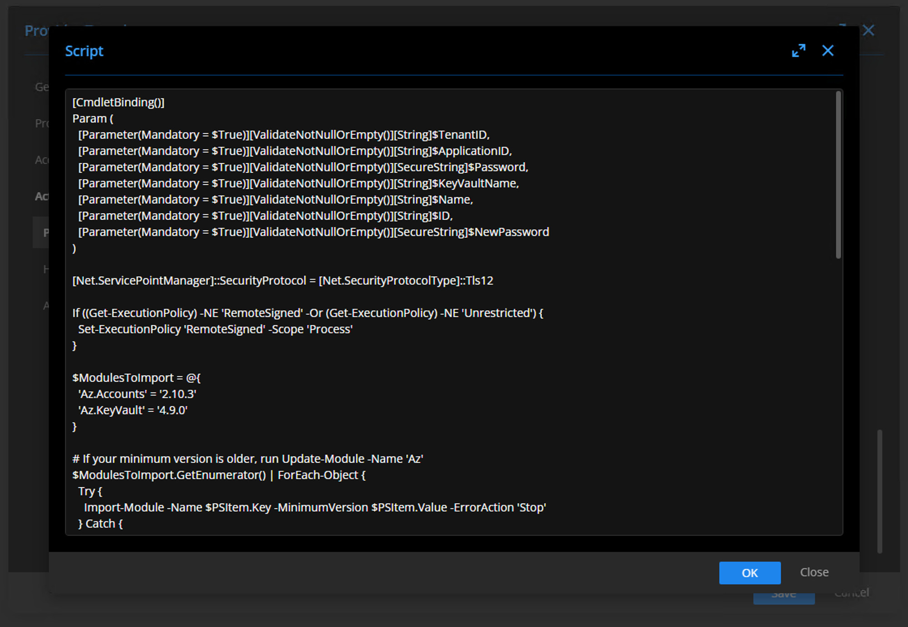

10. On the Heartbeat section, add the following (spelling, spacing, and mapping matters):

    1. `TenantID` from **Provider** mapped to `TenantID`.
    2. `ApplicationID` from **Provider** mapped to `ApplicationID`.
    3. `Password` from **Provider** and mapped to `Password`.
    4. `KeyVaultName` from **Provider** and mapped to `KeyVaultName`.
    5. `Name` from **Account** and mapped to `Name`.
    6. `Secret` from **Account** mapped to `Secret`.
    7. `ID` from **Account** and mapped to `ID`.

    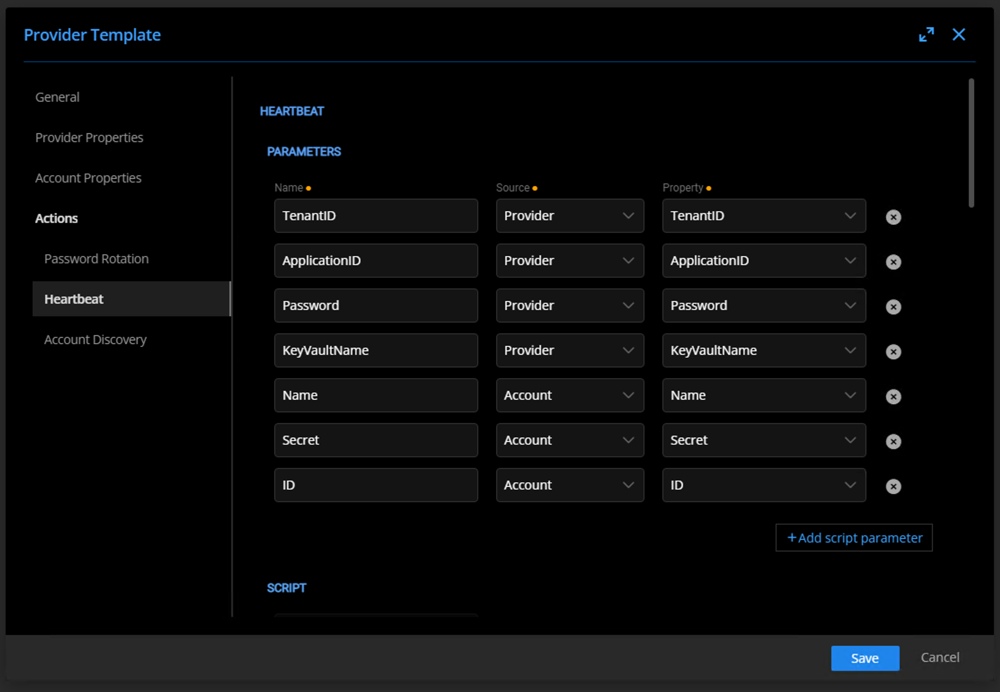

11. Scroll down to the bottom of the Heartbeat section and click on the Edit button to paste in the script located here in the repository: *PAM-Providers/Providers/Azure Key Vault/Script/AzureKeyVaultImageHeartbeat.ps1*

    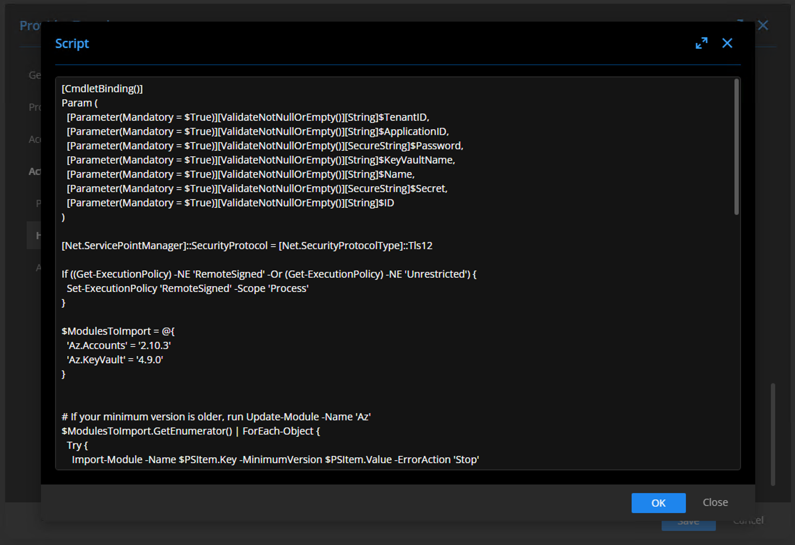

12. On the Account Discovery section, add the following (spelling, spacing, and mapping matters):

    1. `TenantID` from **Provider** mapped to `TenantID`.
    2. `ApplicationID` from **Provider** mapped to `ApplicationID`.
    3. `Password` from **Provider** and mapped to `Password`.
    4. `KeyVaultName` from **Provider** and mapped to `KeyVaultName`.

    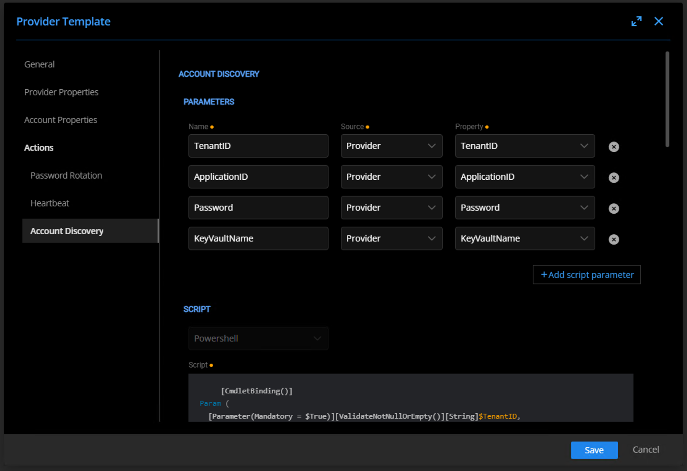

13. Scroll down to the bottom of the Heartbeat section and click on the Edit button to paste in the script located here in the repository: *PAM-Providers/Providers/Azure Key Vault/Script/AzureKeyVaultImageAccountDiscovery.ps1*

    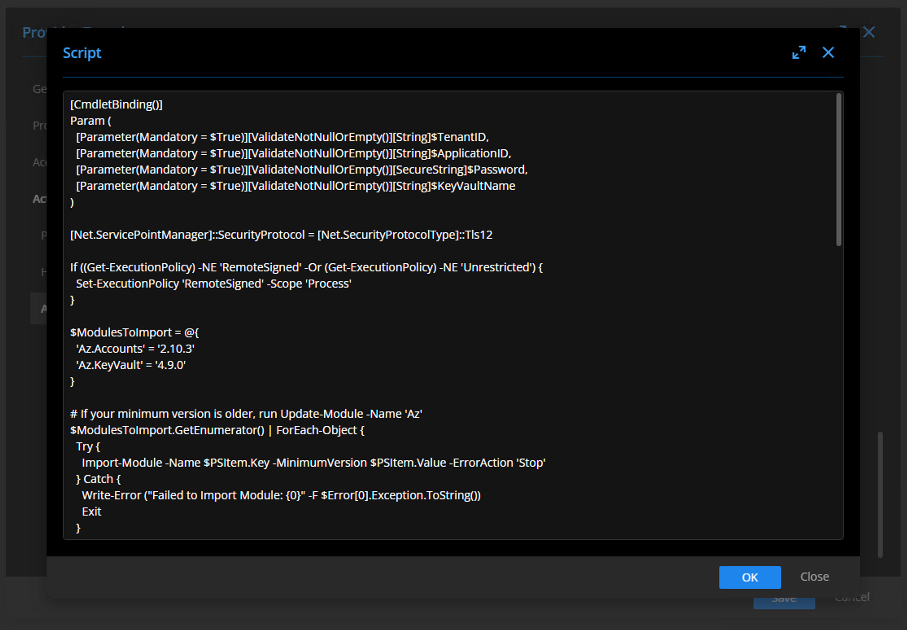

14. Finally, click the **Save** button.

15. Navigate to **Administration → Privileged Access → Providers** and click the **+** (plus) button to add the newly created Azure Key Vault provider.

    

16. Click on the Custom section and the Azure Key Vault provider.

    

17. Enter a Name for the Provider, here Azure Key Vault is used. Scroll down and enter the TenantID (Azure) and ApplicationID (Azure Application Registration ID property). Click the Save button.

    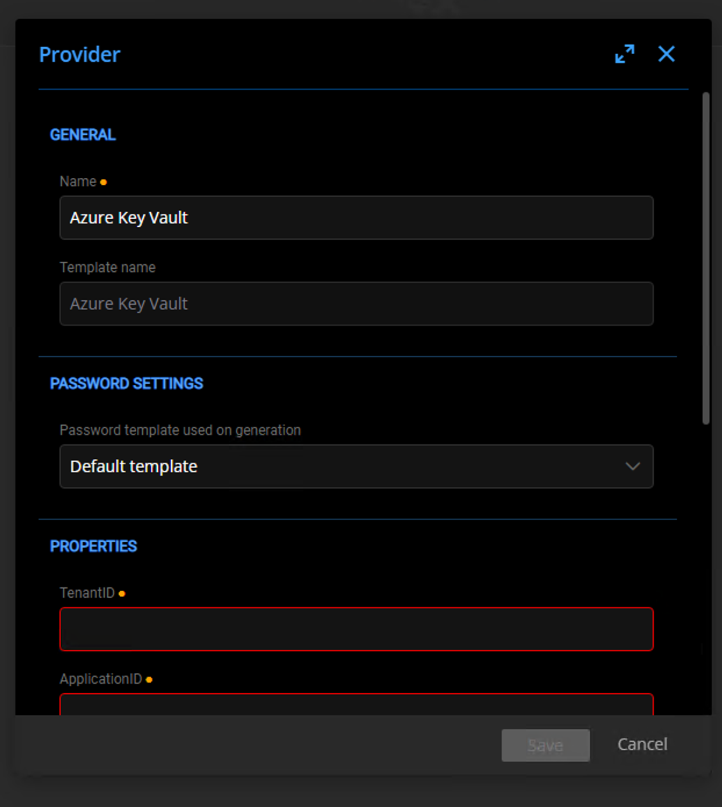

    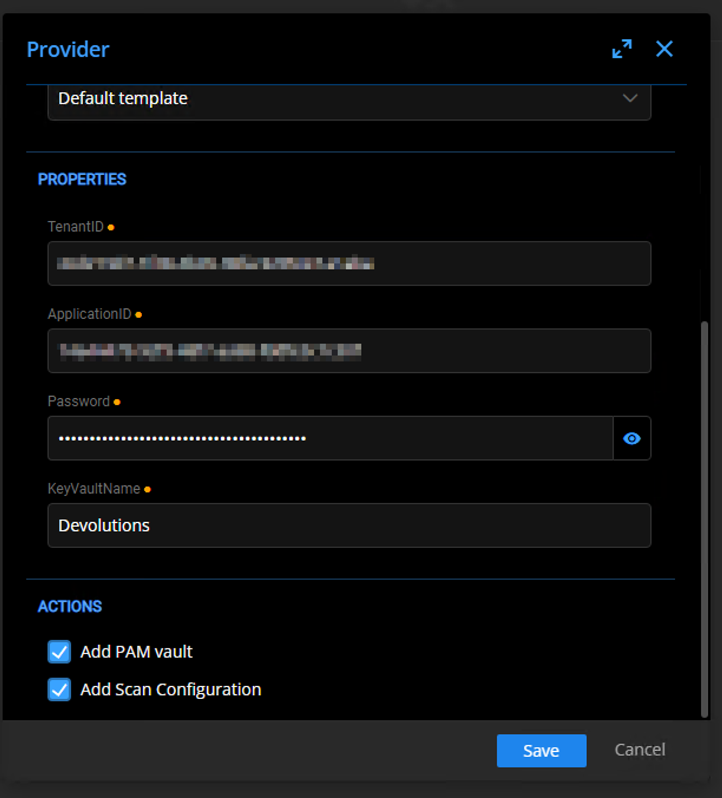

18. Navigate to **Administration → Privileged Access → Account Discovery** and once the scan has completed, click the number contained in the results field.

    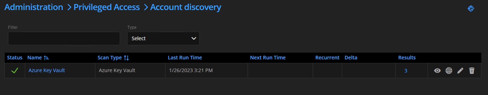

19. Check the boxes next to each value to manage and click the blue import button in the upper right.

    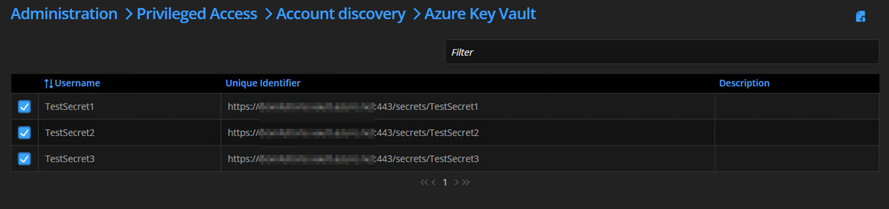

20. Leave the defaults, and click the **OK** button to import and manage the found accounts. You may not want to reset on import, if the key vault secrets are currently in use.

    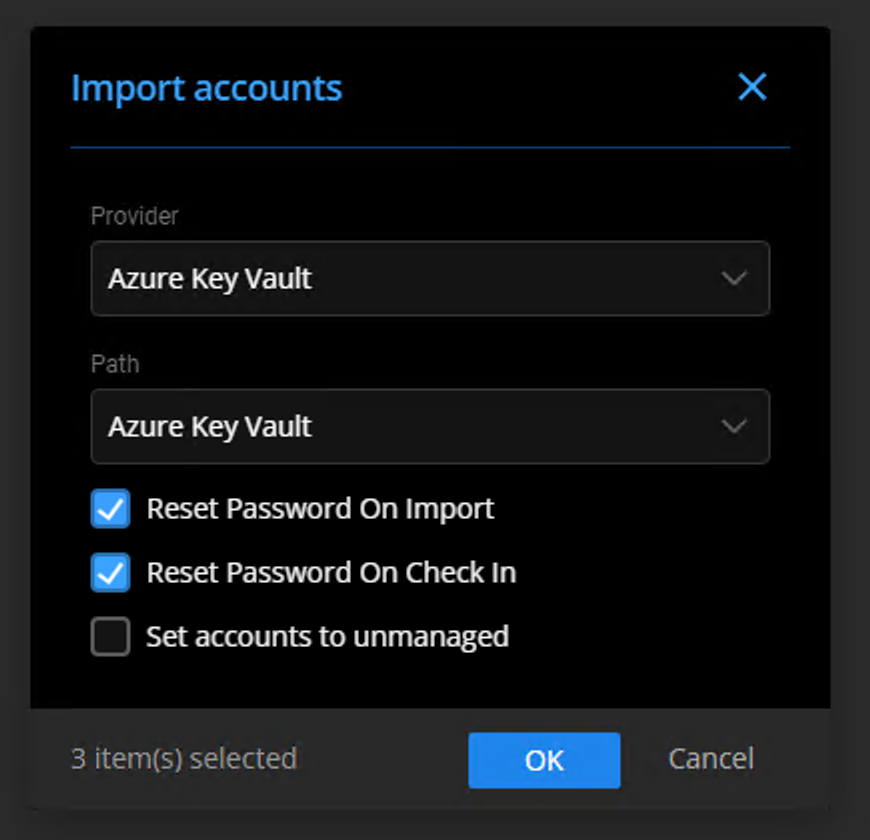
