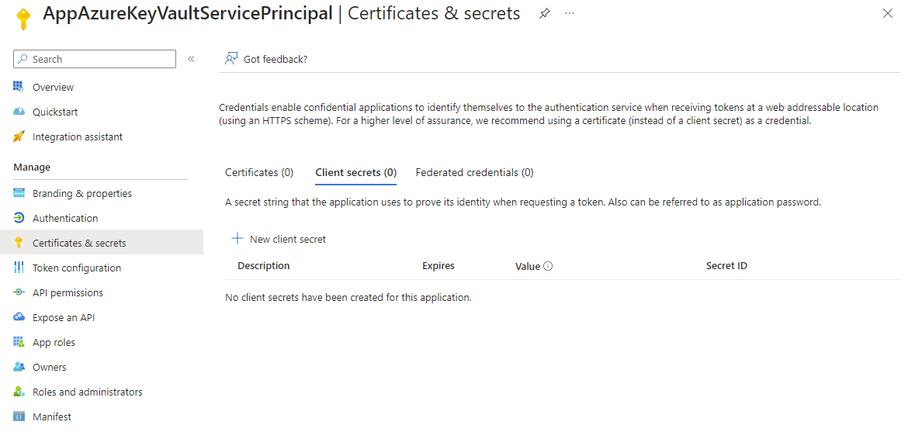
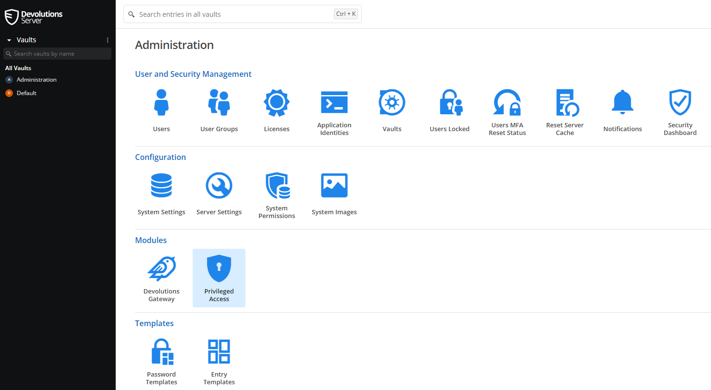
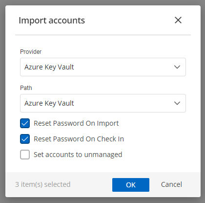

The Azure Key Vault (AKS) provider was last tested on **05/20/2024** and against Devolutions Server (DVLS) version **v2024.1.14.0**. The provider allows you to:

- Import AKS Secrets
- Rotate AKS Secret Values

## Prerequisites

You must have a previously created Azure Key Vault to manage with the Devolutions Server Privileged Access Module (PAM) solution.

> The PowerShell modules listed below are the required version to install. Newer versions will not work correctly at this time.

- [**Az.Accounts** - 2.16.0](https://www.powershellgallery.com/packages/Az.Resources/)

    ```PowerShell
    Install-Module -Name 'Az.Accounts' -Scope 'AllUsers' -RequiredVersion '2.16.0'
    ```

- [**Az.KeyVault** - 5.2.1](https://www.powershellgallery.com/packages/Az.KeyVault/)

  ```PowerShell
  Install-Module -Name 'Az.KeyVault' -Scope 'AllUsers' -RequiredVersion '5.2.1'
  ```

## Registering an Azure Active Directory Application for Service Principal Access

1. Navigate to **Microsoft Entra ID → App registrations** in the Microsoft Azure Portal. Once there, click the **New registration** button.

    

2. Enter a name for the application. In this example, the application is named *AppAzureKeyVaultImageServicePrincipal*. All other values are left as their defaults.

    

3. Once created, click on the newly created application.

    

4. Navigate to **Certificates & secrets** section, select the **Client secrets** tab, and click the **New client secret** button.

    

5. Here the defaults of 180 days are used and, in this example a description of **PasswordAccessKeyVault**.

    

    

6. Navigate to **Azure Portal → Key vaults → "Your Key Vault" → Access configuration**. Ensure that the option for **Azure role-based access control (recommended)** is selected.

    

7. Next, navigate to **Access Control (IAM)** and click on the **Add** button and choose **Add role assignment**.

    

8. You will add two different IAM roles to your previously created Azure app. Filter by _Key Vault_ and choose the first role of **Key Vault Reader** and click the **Next** button.

    

9. Choose to assign access to a user, group, or service principal and click the **Select members** link. Enter and select your previously created service principal.

    

10. Once added, click **Review + assign**, and again, to confirm the selection.

    

11. With the first permission added once again, click on the **Add** button and choose **Add role assignment**. filter by _Key Vault_ and choose the second role of **Key Vault Secrets Officer** and click the **Next** button.

    

12. As before, select your previously created service principal and once added, review and assign to finish the selection.

13. Once completed, you will see both roles added to your service principal.

    

## Importing the Azure Key Vault PAM Provider JSON

An included `Azure Key Vault.json` file is located in the repository that creates the PAM Provider for you.

## Manually Setting Up the Azure Key Vault PAM Provider

Now that the Azure Key Vault is setup for use with the Devolutions Server PAM module, read on to configure PAM itself for use with the module.

1. Launch the Devolutions Server web portal, and navigate to **Administration → Privileged Access**.

    

2. Click the **Providers** button.

    

3. Click the **Template** button.

    

4. Click the **Add** button.

    

5. On the General tab, enter a name and check the Password rotation, Heartbeat, and Account discovery checkboxes.

    

6. On the Provider Properties section, add the following (spelling and spacing matters):

   1. `TenantID` as a **Mandatory** String property.
   2. `ApplicationID` as a **Mandatory** String property.
   3. `Password` as a **Mandatory** Password property.
   4. `KeyVaultName` as a **Mandatory** String property.

      

7. On the Account Properties section, add the following (spelling and spacing matters):

   1. `Name` as a **Mandatory** Username property.
   2. `Secret` as a **Mandatory** Password property.
   3. `ID` as a **Mandatory** Unique Identifier property (this may be simply renaming the existing property). This property is also only used during discovery to ensure uniqueness.

      

8. On the Password Rotation section, add the following (spelling, spacing, and mapping matters):

   1. `TenantID` from **Provider** and mapped to `TenantID`.
   2. `ApplicationID` from **Provider** and mapped to `ApplicationID`.
   3. `Password` from **Provider** and mapped to `Password`.
   4. `KeyVaultName` from **Provider** and mapped to `KeyVaultName`.
   5. `Name` from **Account** and mapped to `Name`.

      

9. Scroll down to the bottom of the Password Rotation section and click the **Edit** button to paste in the script located here in the repository: *PAM-Providers/Providers/Azure Key Vault/Script/AzureKeyVaultImageResetPassword.ps1*

    

10. On the Heartbeat section, add the following (spelling, spacing, and mapping matters):

    1. `TenantID` from **Provider** mapped to `TenantID`.
    2. `ApplicationID` from **Provider** mapped to `ApplicationID`.
    3. `Password` from **Provider** and mapped to `Password`.
    4. `KeyVaultName` from **Provider** and mapped to `KeyVaultName`.
    5. `Name` from **Account** and mapped to `Name`.
    6. `Secret` from **Account** mapped to `Secret`.

    

11. Scroll down to the bottom of the Heartbeat section and click the **Edit** button to paste in the script located here in the repository: *PAM-Providers/Providers/Azure Key Vault/Script/AzureKeyVaultImageHeartbeat.ps1*

    

12. On the Account Discovery section, add the following (spelling, spacing, and mapping matters):

    1. `TenantID` from **Provider** mapped to `TenantID`.
    2. `ApplicationID` from **Provider** mapped to `ApplicationID`.
    3. `Password` from **Provider** and mapped to `Password`.
    4. `KeyVaultName` from **Provider** and mapped to `KeyVaultName`.

    

13. Scroll down to the bottom of the Heartbeat section and click on the Edit button to paste in the script located here in the repository: *PAM-Providers/Providers/Azure Key Vault/Script/AzureKeyVaultImageAccountDiscovery.ps1*

    

14. Finally, click the **Save** button.

15. Navigate to **Administration → Privileged Access → Providers** and click the **+** (plus) button to add the newly created Azure Key Vault provider.

    

16. Click on the **AnyIdentity** section and the **Azure Key Vault** provider.

    

17. Enter a **Name** for the Provider, here **Azure Key Vault** is used. Scroll down and enter the **TenantID** (Azure), **ApplicationID** (Azure Application Registration ID property), **Password**, and **KeyVaultName**. Check the options to **"Add PAM vault"** and **"Add Scan Configuration"**. Finally, click the **Save** button.

    

18. The **Scan configuration** modal will show, enter a **Name** and click the **OK** button to start the scan.

    

19. Navigate to **Administration → Privileged Access → Account Discovery** and once the scan has completed, click the number contained in the results field.

    

20. Check the boxes next to each secret to import and click the blue import button in the upper right.

    

21. Change the **Path** to the PAM vault to import into and click the **OK** button to import and manage the found accounts. You may not want to reset on import, if the key vault secrets are currently in use.

    